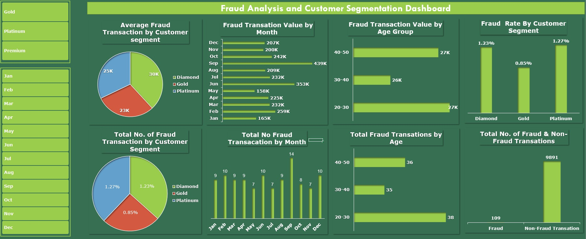

Fraud Detection and Customer Segmentation Dashboard

This project focuses on enhancing fraud detection and customer segmentation strategies within a financial institution's credit card system. The following steps were taken to achieve this:

    Data Utilization:
        Comprehensive dataset including customer demographics, credit card details, transaction data, and fraud indicators.

    Integrated Analysis System:
        Data cleaning and exploration techniques to ensure data accuracy and consistency.
        Creation of relationships between datasets using Power Pivot.

    Advanced Analysis:
        Identification of fraudulent transaction patterns.
        Segmentation of customers based on behaviour and demographics.

    Interactive Dashboard:
        Incorporation of PivotTables, PivotCharts, and slicers for data exploration.
